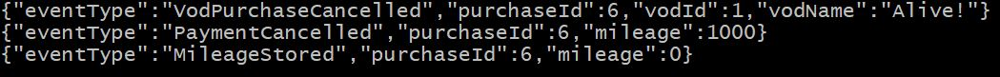

# team3_project : VOD store
---
## Contents
  - [서비스 시나리오](#1)
  - [분석/설계 - 구조](#2)
  - [분석/설계 - Event Storming 결과](#3)
  - [분석/설계 - 헥사고날 아키텍처 다이어그램 도출](#4)
  - [구현및테스트 - 동기식 호출](#5)
  - [구현및테스트 - 비동기식 호출](#6)
  - [구현및테스트 - Circuit Breaker](#7)   
  - [구현및테스트 - 테스트 과정](#8)   
  - [운영 - CI/CD](#9)   

---
## <div id="1">서비스 시나리오</div>
  * 기능적 요구사항
    1. 사용자가 VOD 구매를 클릭한다.
    2. 사용자가 VOD를 결제한다. (금액은 없고 자동 결제됨)
    3. VOD 결제시 1000점의 마일리지를 적립한다.
    4. 적립된 마일리지가 5000점 이상이면 VOD 1편을 공짜로 볼 수 있다. (5000점이 차감됨)
    5. 사용자가 신규 VOD 등록을 요청하면 새로운 VOD가 등록된다.

  * 비기능적 요구사항
    1. 트랜잭션
       - 결제가 되지 않은 VOD는 승인되지 않는다. > Sync (req-res)
    2. 장애격리
       - VOD 관리 기능이 수행되지 않아도 VOD LIST는 수행된다. > Async (pub-sub)
       - Payment시스템이 과중되면 결제를 잠시후에 하도록 유도한다. > Circuit breaker
---
## 분석/설계
### <div id="2">분석/설계 - DDD구조</div>
| No | Part | Port | gitHub | Memo |
| :--------: | :--------: | :--------: | :-------- | :-------- |
| 0 | Project Info | - | https://github.com/2020team3/project_info.git | Project Memo |
| 1 | Gateway | 8080 | https://github.com/2020team3/gateway.git | Gateway |
| 2 | VOD List | 8081 | https://github.com/2020team3/vodlist.git | print VOD List, Add VOD microservice |
| 3 | VOD Purchase | 8082 | https://github.com/2020team3/vodpurchase.git | VOD Purchase microservice (Call payment) |
| 4 | payment | 8086 | https://github.com/2020team3/payment.git | pay microservice |
| 5 | mileage | 8087 | https://github.com/2020team3/mileage.git | plus/minus mileage microservice |
---
### <div id="3">분석/설계 - Event Storming 결과</div>
  * 아래와 같이 도출되었음

  * 도메인 서열 분리
    - [ Core Domain ] : VOD Purchase - 없어서는 안될 핵심 서비스
    - [ Supporting Domain ] : VOD List, mileage - 경쟁력을 내기위한 서비스
    - [ General Domain ] : pay - 결제서비스

  * 1차 수정 후 아래와 같이 변경되었음

  * 2차 수정 후 아래와 같이 변경되었음

---
### <div id="4">분석/설계 - 헥사고날 아키텍처 다이어그램 도출</div>

---
## 구현 및 테스트
### <div id="5">구현및테스트 - 동기식 호출</div>
  * 동기식 발신
```
RestTemplate restTemplate = VodPurchaseApplication.applicationContext.getBean(RestTemplate.class);
String payUrl = "http://localhost:8086/payments";
Payment payment = new Payment();
payment.setPurchaseId(this.getPurchaseId());
restTemplate.postForEntity(payUrl, payment, String.class);
```   
### <div id="6">구현및테스트 - 비동기식 호출</div>
  * kafka 구성
    - Microservice별로 아래와 같이 application.yml에 설정하였음
```
kafka:
  binder:
    brokers: localhost:9092
bindings:
  input:
    group: pay
    destination: team3vod
    contentType: application/json
  output:
    destination: team3vod
    contentType: application/json
```    
  * 비동기식 발신
```
@PostUpdate
public void cancelOrder() {
  if(orderStatus != null && orderStatus.equals("cancel")) {
    System.out.println("[VodPurchase.java::cancelOrder ]");
    VodPurchaseRepository vodPurchaseRepository =
        VodPurchaseApplication.applicationContext.getBean(VodPurchaseRepository.class);
    Optional<VodPurchase> opt = vodPurchaseRepository.findById(this.getPurchaseId());
    VodPurchase vod = opt.get();

    VodPurchaseCancelled vodPurchaseCancelled = new VodPurchaseCancelled();
    vodPurchaseCancelled.setPurchaseId(vod.getPurchaseId());
    vodPurchaseCancelled.setVodId(vod.getVodId());
    vodPurchaseCancelled.setVodName(vod.getVodName());

    ObjectMapper objectMapper = new ObjectMapper();
      String json = null;

      try {
          json = objectMapper.writeValueAsString(vodPurchaseCancelled);
      } catch (JsonProcessingException e) {
          throw new RuntimeException("JSON format exception", e);
      }

      System.out.println("[VodPurchase.java:80:cancelOrder] "+json);

      Processor processor = VodPurchaseApplication.applicationContext.getBean(Processor.class);
      MessageChannel outputChannel = processor.output();

      outputChannel.send(MessageBuilder
              .withPayload(json)
              .setHeader(MessageHeaders.CONTENT_TYPE, MimeTypeUtils.APPLICATION_JSON)
              .build());
  }
}
```  
  * 비동기식 수신
```
@StreamListener(Processor.INPUT)
  public void vodPurchaseCancelled(@Payload VodPurchaseCancelled vodPurchaseCancelled) {
      if (vodPurchaseCancelled.getEventType().equals("VodPurchaseCancelled")) {
        System.out.println("=========VodPurchaseCancelled=========");  
        paymentRepository.findById(vodPurchaseCancelled.getPurchaseId())
                  .ifPresent(
                          payment -> {
                            payment.setPayStatus("cancel");
                            payment.setPurchaseId(vodPurchaseCancelled.getPurchaseId());
                            paymentRepository.save(payment);
                          }
                  )
          ;
      }
  }
```
  * kafka Queue 내부

---
### <div id="7">구현및테스트 - Circuit Breaker</div>
  * Circuit Breaker 동작 확인
    - 아래와 같이 부하측정기 siege 명령으로 확인.
    - Windows 내부의 Ubuntu siege 명령은 아래와 같은 오류가 발생함. 결과만 확인 가능함
  [error] unable to set close control sock.c:141: Invalid argument
  [error] unable to set close control sock.c:141: Invalid argument  
    - VMWare ubuntu에서 아래와 같이 확인
```
CMD#>siege -c100 -t60s -r10 --content-type "application/json" 'http://localhost:8082/vodPurchases POST {"vodId":"2", "vodName":"ToBusan"}'

root@u1:/work/siege-3.1.4# siege -c100 -t60s -r10 --content-type "application/json" 'http://localhost:8082/vodPurchases POST {"vodId":"2", "vodName":"ToBusan"}'
[error] CONFIG conflict: selected time and repetition based testing
defaulting to time-based testing: 60 seconds
** SIEGE 3.1.4
** Preparing 100 concurrent users for battle.
The server is now under siege...
HTTP/1.1 201  24.85 secs:     249 bytes ==> POST http://localhost:8082/vodPurchases
HTTP/1.1 201  23.92 secs:     249 bytes ==> POST http://localhost:8082/vodPurchases
< 중략 >
아래와 같이 500 Return / 201 Return으로 Random하게 바뀜
(610이상인 경우...)

HTTP/1.1 500  43.37 secs:     126 bytes ==> POST http://localhost:8082/vodPurchases
HTTP/1.1 500  44.02 secs:     126 bytes ==> POST http://localhost:8082/vodPurchases
< 중략 >
HTTP/1.1 201  19.03 secs:     251 bytes ==> POST http://localhost:8082/vodPurchases
HTTP/1.1 500  44.40 secs:     126 bytes ==> POST http://localhost:8082/vodPurchases
HTTP/1.1 201  42.74 secs:     251 bytes ==> POST http://localhost:8082/vodPurchases
HTTP/1.1 201  44.30 secs:     251 bytes ==> POST http://localhost:8082/vodPurchases
HTTP/1.1 500  44.35 secs:     126 bytes ==> POST http://localhost:8082/vodPurchases
< 중략 >
- 성공률 91% 기록함
Lifting the server siege..      done.

Transactions:		         165 hits
Availability:		       91.16 %
Elapsed time:		       59.43 secs
Data transferred:	        0.04 MB
Response time:		       29.43 secs
Transaction rate:	        2.78 trans/sec
Throughput:		        0.00 MB/sec
Concurrency:		       81.70
Successful transactions:         165
Failed transactions:	          16
Longest transaction:	       44.86
Shortest transaction:	        0.85

LOG FILE: /usr/local/var/siege.log
You can disable this log file notification by editing
/root/.siege/siege.conf and changing 'show-logfile' to false.
[error] unable to create log file: /usr/local/var/siege.log: No such file or directory
root@u1:/work/siege-3.1.4#
```  
---
### <div id="8">테스트 과정</div>
  * Local 테스트
    1. vodList 조회
        - http localhost:8081/vodLists
        - 초기값으로 영화 2편이 있음
          
    2. VOD 추가
        - http localhost:8081/vodLists vodName="GoGo"
    
    3. 이하 생략. 아래 cloud 테스트와 같은 방식으로 테스트하였음.

  * Cloud 테스트
    1. Http machine에 접속하여 테스트 수행
       - kubectl exec -it httpie bin/bash
    2. VOD list 조회
       - http http://t3vodlist:8080/vodLists
    
    3. VOD 추가
       - http http://t3vodlist:8080/vodLists vodId=3 vodName="GoGo"
   
    4. VOD 구매
       - http http://t3vodpurchase:8080/vodPurchases vodId=1 vodName=Alive!

       - http http://t3payment:8080/payments/6

       - http http://t3mileage:8080/mileages/6

       - Kafka


    5. VOD 구매취소
        - http PATCH http://t3vodpurchase:8080/vodPurchases/6 orderStatus=cancel

        - http http://t3payment:8080/payments/6

        - http http://t3mileage:8080/mileages/6

        - Kafka


## <div id="9">CI/CD</div>
  * CI/CD
    - kubenetes, kafka cloud 환경에 설치
  
    - GitHub Source와 AWS CodeBuild 연동
        - github에 source code commit시 자동 빌드 및 배포


# 끝.
